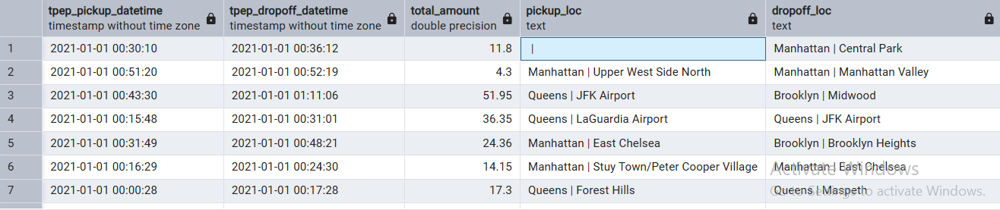

## To convert a notebook to a Python file

```shell
uv run jupyter nbconvert --to=script data_ingestion.ipynb
mv data_ingestion.py ingest_data.py  # rename the Python file created
```

## To run the Python file to ingest NYC taxi data

```shell
uv run python ingest_data.py \
  --pg-user=root \
  --pg-pass=root \
  --pg-host=localhost \
  --pg-port=5432 \
  --pg-db=ny_taxi \
  --target-table=yellow_taxi_trips
```

## To use a virtual Docker network to allow containers to communicate with each other

```shell
docker network create pg-network # create a virtual Docker network
docker network rm pg-network # remove the network
docker network ls # view existing networks
```

- In the Docker run command, specify `--network=pg-network` to run the containers in the created network.
- You can also specify the container names in the Docker run command to differentiate and allow the containers to find each other within the network. For example: `--name pgdatabase` and `--name pgadmin`. In this case, pgdatabase is the host name for the Postgres database server.

## To stop or remove Docker containers
```shell
docker stop $(docker ps -q) # stop all running containers
docker rm -f $(docker ps -aq) # stop and remove all containers
```

## To ingest the Taxi zones CSV file into the Postgres database running in a Docker container

- Create a table by running this script on PgAdmin:

```sql
CREATE TABLE public.zones(
	LocationID SERIAL PRIMARY KEY,
	Borough VARCHAR(50),
	Zone VARCHAR(100),
	service_zone VARCHAR(50)
)
```

- Since the csv file is small, download it and copy it into the working directory.
- Use docker copy to copy the csv from the working directory into the docker volume.

```shell
docker cp "/c/Users/path to the working directory/taxi_zone_lookup.csv" container_name:/tmp/taxi_zone_lookup.csv
```
- Connect to the PostgreSQL database container and run \copy.

```shell
docker exec -it container_name psql -U username -d database_name -c "\copy table_name FROM '/tmp/file.csv' DELIMITER ',' CSV HEADER;"
```

## Using JOINS when some Location IDs are not in either tables

```sql

DELETE FROM zones WHERE locationid = 142;

SELECT
    tpep_pickup_datetime,
    tpep_dropoff_datetime,
    total_amount,
    CONCAT(zpu.borough, ' | ', zpu.zone) AS "pickup_loc",
    CONCAT(zdo.borough, ' | ', zdo.zone) AS "dropoff_loc"
FROM
    yellow_taxi_trips t
LEFT JOIN
    zones zpu ON t."PULocationID" = zpu.locationid
JOIN
    zones zdo ON t."DOLocationID" = zdo.locationid
LIMIT 100;
```

Result:

